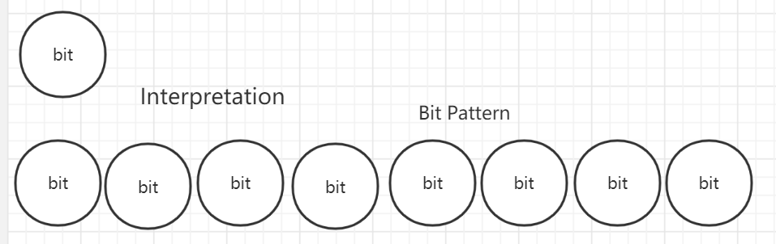

# Chapter2 Representing and Manipulation

page 30-119  from 2020-04-02 to 2020-04-30

## Introduction

Modern computers store and process information represented as 2-valued signals. These lowly binary digits, or bits, form the basis of the digits revolution. The familiar decimal, or base-10 is natural for ten-fingered humans.

**Why Two-valued Signals?**

1. Work better when building machines that store and process information

2. Readily represented, stored, and transmitted

   		> presence or absence of a hole 
   		>
   		> high or low voltage on a wire
   		>
   		> magnetic domain oriented clockwise or counterclockwise

3. Storing and performing computations on 2-valued signals using electronic circuit is very simple and reliable

4. Easily integrate millions, or even billions, of circuits on a single silicon chip

   Group Bits

   > group bits together ------> apply some interpretation that gives meaning to the different possible bit patterns---->represent the elements of any finite set
   >
   > 1. Encode nonnegative numbers
   >
   > 2. Encode the letters and symbols in a document
   >
   > 3. Encodings to negative numbers and  approximate real numbers
   >
   >    

## 2.1 Information Storage

## 2.2 Integer Representations

## 2.3 Integer Arithmetic 

## 2.4 Floating Point

## 2.5 Summary
